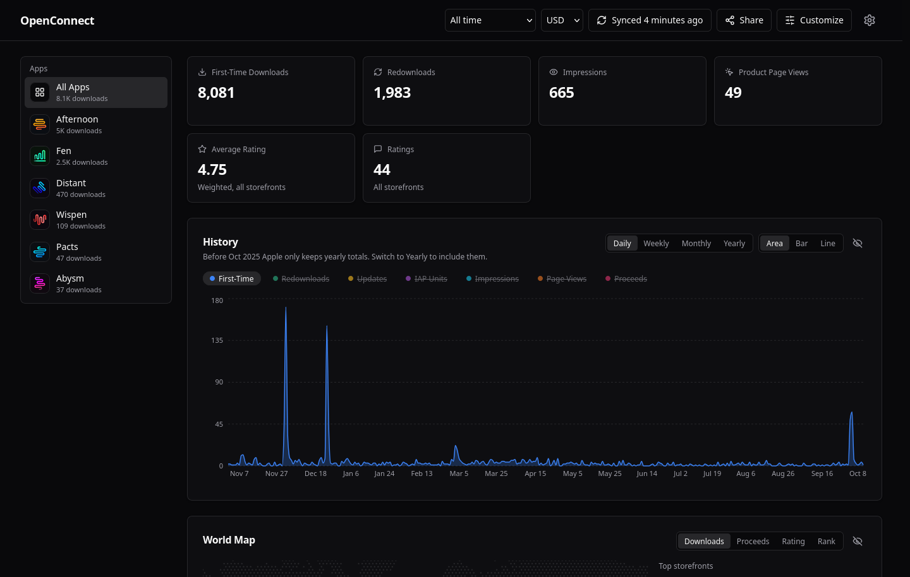
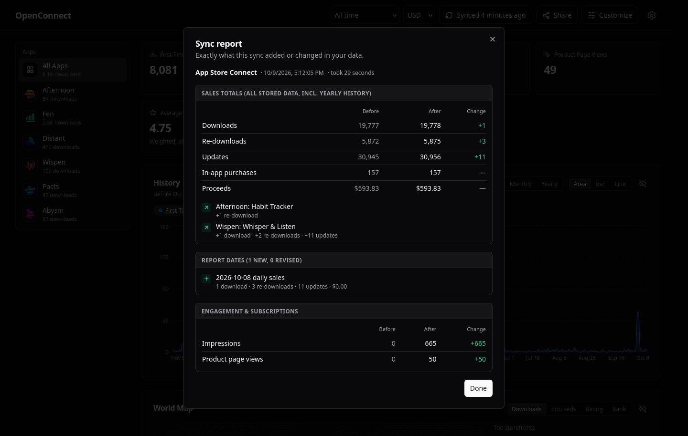
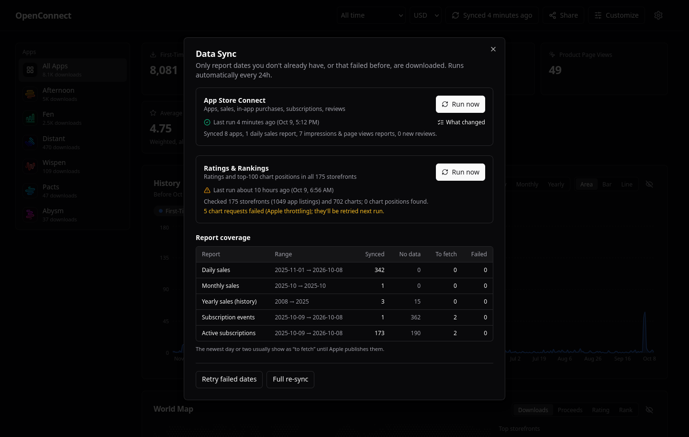

<div align="center">

# OpenConnect

**A self-hosted App Store Connect dashboard.**
Downloads, proceeds, in-app purchases, subscriptions, reviews, impressions, plus ratings and top-chart positions in all 175 App Store storefronts. Everything stays on your own machine.

[Quick start](#quick-start) · [Features](#features) · [Configuration](#configuration) · [Security](#security) · [How syncing works](#how-syncing-works) · [Contributing](CONTRIBUTING.md)

[](https://github.com/OddOmens/OpenConnect/actions/workflows/ci.yml)
[](LICENSE)



</div>

## Why

App Store Connect spreads your numbers over several slow pages and only keeps daily sales for a year. OpenConnect pulls everything into one fast dashboard backed by a local SQLite file. It keeps the history, and nothing leaves your machine except requests to Apple.

## Features

- **Sales & proceeds:** first-time downloads, re-downloads, updates, in-app purchases and proceeds, by day, week, month or year. Proceeds are converted to your choice of display currency.
- **Subscriptions:** active subscribers, trials, offers, billing retry, and subscription events.
- **Customer reviews:** every review from every storefront, with developer responses.
- **Impressions & product page views** from Apple's Analytics Reports API.
- **Ratings & rankings in 175 storefronts:** rating counts and averages per country, plus where your apps sit in the Top Free, Top Paid and Top Grossing charts, overall and by category.
- **World map, device and territory breakdowns.**
- **Sync report:** after every sync you get a popup that lists exactly what changed. It covers new and revised report dates, per-app deltas, new reviews, rating changes, and chart moves.
- **Share cards:** render PNG cards of your stats to post anywhere.
- **Fully customizable:** show, hide or reorder every section, metric, column and chart series. Light, dark or system theme.
- **Incremental sync:** a routine sync takes a handful of requests, not a 365-day backfill.
- **Private by default:** one password protects everything, and the container runs read-only with no Linux capabilities.

<table>
  <tr>
    <td></td>
    <td></td>
  </tr>
  <tr>
    <td align="center"><sub>The sync report: what each sync changed</sub></td>
    <td align="center"><sub>Sync status and report coverage</sub></td>
  </tr>
</table>

## Quick start

You need Docker and an App Store Connect API key ([how to create one](#api-key)).

```bash
git clone https://github.com/OddOmens/OpenConnect.git
cd OpenConnect
cp .env.example .env                    # fill in Key ID, Issuer ID, Vendor Number
cp ~/Downloads/AuthKey_XXXXXXXXXX.p8 keys/
docker compose up -d --build
```

Then:

1. Open **http://localhost:3000**.
2. On first start, OpenConnect asks you to choose a password. To prove you own the server, it also asks for a one-time setup code. Find the code with:
   ```bash
   docker logs openconnect
   ```
3. The first sync starts on its own and backfills your history, which takes a few minutes. After that, syncs run every 6 hours.

You can also leave `.env` empty and enter everything in **Settings → App Store Connect**, including pasting the contents of the `.p8` file.

### API key

Create a **Team Key** in App Store Connect → Users and Access → Integrations → App Store Connect API.

| Data | Key role needed |
| --- | --- |
| Apps, customer reviews | Any role (e.g. Customer Support, App Manager) |
| Sales, proceeds, IAPs, subscriptions | **Sales** (or Finance / Admin) |
| Impressions & page views | **Admin** once, to ask Apple to start generating analytics reports. A Sales key can download them afterwards. |
| Ratings & rankings in 175 storefronts | Nothing. Uses Apple's public lookup and top-chart feeds. |

Your **Vendor Number** is in App Store Connect → Payments and Financial Reports, at the top left under your name.

## Configuration

Set these in `.env` next to `docker-compose.yml`. Anything marked *Settings* can also be entered in the browser instead.

| Variable | Default | What it does |
| --- | --- | --- |
| `ASC_KEY_ID` | | API key ID. *Settings* |
| `ASC_ISSUER_ID` | | API issuer ID. *Settings* |
| `ASC_VENDOR_NUMBER` | | Vendor number for sales reports. *Settings* |
| `ASC_PRIVATE_KEY_PATH` | auto | Path to the `.p8` inside the container. Without it, `AuthKey_<KEY_ID>.p8` is found in `./keys` automatically. |
| `ASC_KEYS_DIR_HOST` | `./keys` | Host folder holding the `.p8`, mounted read-only. |
| `PORT` | `3000` | Port on the host. |
| `BIND_ADDRESS` | `127.0.0.1` | `127.0.0.1` means only this computer can connect. `0.0.0.0` lets your whole network connect. |
| `OPENCONNECT_PASSWORD_REQUIRED` | `true` | `false` turns the password off completely. See [Running without a password](#running-without-a-password). |
| `OPENCONNECT_PASSWORD` | | Fixes the password here instead of choosing it in the browser. |
| `OPENCONNECT_PASSWORD_FILE` | | Reads the password from a file (e.g. a Docker secret) instead. |
| `OPENCONNECT_ALLOWED_HOSTS` | | Only used with the password off: extra hostnames you open the dashboard by, comma-separated. |
| `TS_AUTHKEY`, `TS_HOSTNAME` | | For [HTTPS on your tailnet](#https-with-tailscale). |

Sync intervals, which data to sync, which charts and storefronts to check, display currency and the dashboard layout are all in **Settings**.

## Security

OpenConnect holds your App Store Connect key and your revenue data, so it is locked down by default.

**Sign-in**
- One password protects every page and API. The only exception is `/api/health`, which reveals nothing.
- On first start, nobody can claim a fresh install before you do. Choosing the password requires a random one-time setup code that is printed only in the server log.
- Passwords are stored as salted **scrypt** hashes using OWASP's recommended cost. Older hashes are upgraded the next time you sign in.
- A session is a random 256-bit token in an `HttpOnly`, `SameSite=Lax` cookie, marked `Secure` over HTTPS. The database stores only a SHA-256 hash of it. Sessions last 30 days. Changing the password, or using "Sign out everywhere", ends all other sessions.
- After 5 wrong passwords from one client, each further attempt waits longer: 30 s, then 60 s, and so on, up to 15 minutes. After 20 wrong attempts across all clients, the same wait applies to everyone. The global limit exists because the client address comes from a header that can be faked.

**Requests and browser**
- Every request that changes something is refused when the browser says it came from another site. This is CSRF protection.
- A strict Content-Security-Policy stops scripts from loading from anywhere but the server, and stops the page from being framed. The page also does not send a referrer.
- The `.p8` key is never sent back to the browser. Settings only shows whether a key is present.

**Container and files**
- The container filesystem is read-only, has no Linux capabilities and cannot gain privileges (`no-new-privileges`). It runs as a non-root user.
- The database is created readable by its owner only (`0600`, in a `0700` folder).
- The `.p8` key is mounted read-only.
- `.env`, `keys/`, `data/`, `*.p8` and `*.pem` are excluded by both `.gitignore` and `.dockerignore`. They never end up in git or in the image.

**Recommendations**
- Keep `BIND_ADDRESS=127.0.0.1` unless you need access from other devices. To reach the dashboard from elsewhere, prefer [Tailscale](#https-with-tailscale) over opening a port.
- Never expose OpenConnect directly to the internet.
- If you set `OPENCONNECT_PASSWORD`, anyone who can run `docker inspect` can read it. `OPENCONNECT_PASSWORD_FILE` with a Docker secret avoids this. Choosing the password in the browser also avoids it.
- Found a vulnerability? See [SECURITY.md](SECURITY.md).

### Running without a password

If OpenConnect only listens on `127.0.0.1` and you are the only person using the computer, a password may just be in the way:

```bash
# .env
OPENCONNECT_PASSWORD_REQUIRED=false
```

With the password off:
- Anyone who can reach the port can see your data and change settings. A warning is printed to the log on every start.
- Protection against cross-site requests still applies.
- Pages are only served under local hostnames: `localhost`, IP addresses, single-word names, `*.local`, `*.lan`, `*.home.arpa`, `*.internal` and `*.ts.net`. This blocks *DNS rebinding*, a trick that lets a malicious website read services on `localhost`. If you use another hostname, add it to `OPENCONNECT_ALLOWED_HOSTS`.

Set it back to `true` (or remove the line) and restart to turn the password on again.

## How syncing works

- **Only what's missing.** OpenConnect keeps a ledger of every report date it holds. Each run downloads only dates that are missing or failed last time, newest first. Each date is replaced as a unit, so re-syncing never double counts.
- **As far back as Apple allows.** Daily reports cover the last 365 days. The partial month before that comes from a monthly report, and everything older comes from yearly totals, back to your first app's release. Nothing before your first release is requested.
- **On a schedule.** Sales sync every 6 hours, ratings and rankings once a day. Both intervals can be changed in Settings. The **Sync** dialog shows coverage per report type and lets you retry failed dates or force a full re-sync.
- **Currencies.** Proceeds are converted to USD using the latest exchange rates from open.er-api.com, refreshed every 12 hours, and then to your display currency.

### The sync report

When a sync you started finishes, a popup shows exactly what changed:

- **Sales totals**: downloads, re-downloads, updates, in-app purchases and proceeds, before and after, plus which apps moved.
- **Report dates**: each new day, and each day whose numbers Apple *revised*, with old and new figures.
- **Engagement & subscriptions**: impressions, product page views, active subscriptions and subscription events.
- **Reviews**: every new review, plus developer responses that were added or edited.
- **Ratings & rankings**: rating count and average changes per app, plus chart positions gained, lost and moved. Biggest moves are listed first.

Scheduled syncs don't pop up. Open **Sync → What changed** to see the report of the latest run of each job.

## HTTPS with Tailscale

Browsers block some features (like downloading share cards) on plain `http://` pages that aren't `localhost`. To get HTTPS on your tailnet at `https://openconnect.<tailnet>.ts.net`:

```bash
docker compose -f docker-compose.yml -f docker-compose.tailscale.yml up -d --build
docker logs openconnect-tailscale   # first start only: open the login link
```

This needs MagicDNS and HTTPS certificates enabled for your tailnet (admin console → DNS). Set `TS_AUTHKEY` in `.env` to skip the login link.

## Updating, backups and data

```bash
git pull
docker compose up -d --build
```

- All data lives in `./data/dashboard.db` (SQLite), which is mounted into the container. Rebuilds and upgrades keep it.
- **Back up** by copying `./data` while the container is stopped, or at any time with `docker exec openconnect node -e "require('better-sqlite3')('/app/data/dashboard.db').backup('/app/data/backup.db')"`.
- **Start over** by stopping the container and deleting `./data`.
- **Forgot the password?** If it is set with `OPENCONNECT_PASSWORD`, change it there and restart. Otherwise, run `docker exec openconnect node -e "require('better-sqlite3')('/app/data/dashboard.db').prepare(\"DELETE FROM settings WHERE key='auth_password'\").run()"` and restart. Then set a new password with a fresh setup code from `docker logs openconnect`.

## Run without Docker

Requires Node.js 22+.

```bash
npm install
cp .env.example .env.local   # fill in
npm run dev                  # http://localhost:3000
```

Data goes to `./data` (or `DATA_DIR`). The setup code is printed in the terminal.

## Troubleshooting

| Symptom | Fix |
| --- | --- |
| "Private key file not found" | Put `AuthKey_<KEY_ID>.p8` in `./keys`, or paste the key in Settings. |
| Sales sections empty, `HTTP 403` in the Sync dialog | The key lacks the **Sales** role. Create a new key with Sales, Finance or Admin. |
| Impressions say "needs a one-time setup" | Enter an **Admin** key once and sync, then switch back to your Sales key. |
| The newest day or two show as "to fetch" | Normal. Apple publishes daily reports with a delay, and they are retried on every sync. |
| "Too many attempts" on sign-in | Wait it out, at most 15 minutes. Restarting the container also clears it. |
| "This hostname is not allowed" | You are running without a password under a non-local hostname. Add it to `OPENCONNECT_ALLOWED_HOSTS`. |

## Tech

Next.js 16 (App Router) · React 19 · TypeScript · Tailwind CSS · Radix UI · Recharts · SQLite (better-sqlite3) · Satori + resvg for share cards.

## Contributing

Issues and pull requests are welcome. See [CONTRIBUTING.md](CONTRIBUTING.md).

## License

OpenConnect is free to use under the [MIT License with the Commons Clause](LICENSE).

- **Allowed:** using it for your own apps, studio or company (including tracking apps that make money), changing it, forking it, and sharing it or your changes.
- **Not allowed:** selling OpenConnect, for example as a paid product, a paid hosted service, or paid support whose value comes mainly from OpenConnect.

The Commons Clause makes this "source-available" rather than open source by the OSI definition. The code is fully open, but nobody gets to profit from reselling it.

OpenConnect is not affiliated with or endorsed by Apple Inc. App Store and App Store Connect are trademarks of Apple Inc.
